# 2025/06/08--2025/06/15

## Tasks for This Week:

- ML model architecture design
- Cloud infrastructure planning
- Web platform development initiation
- Complete system workflow design

## Work Progress:

### System Architecture Design
- **Data Flow Design**: Completed comprehensive system data flow mapping
- **Cloud Infrastructure**: Designed three-tier distributed architecture
- **ML Pipeline Planning**: Defined environmental data → prediction → AI generation workflow

**System Workflow**

```mermaid
graph TD
    %% User Interaction Layer
    A[👤 User Operating Raspberry Pi] --> B[🎯 Distance Control Encoder]
    A --> C[⏰ Time Control Encoder]
    A --> D[🧭 Magnetometer Direction Sensing]
    
    %% Raspberry Pi Data Processing
    B --> E[📍 Coordinate Calculation Module]
    C --> E
    D --> E
    
    E --> F[🌐 OpenWeather API Call]
    F --> G[📊 Current Environmental Data Acquisition]
    
    %% Cloud ML Prediction
    G --> H[☁️ Cloud ML API Call]
    H --> I[🤖 Machine Learning Model Prediction]
    I --> J[📈 Detailed Prediction Results Generation]
    
    %% Data Storage
    J --> K[🗄️ PostgreSQL Database Storage]
    K --> L[💾 Prediction Data + Analysis Details]
    
    %% AI Image Generation
    J --> M[🎨 AI Image Prompt Construction]
    M --> N[🖼️ DALL-E Image Generation]
    N --> O[☁️ Cloudinary Image Storage]
    
    %% Database Association
    O --> P[🔗 Image URL Associated with Prediction Data]
    P --> K
    
    %% Raspberry Pi Local Display
    N --> Q[📱 HyperPixel Screen Display]
    Q --> R[🎭 Real-time Prediction Image Display]
    R --> S[📊 Prediction Data Overlay Display]
    
    %% Website Exhibition
    L --> T[🌐 Website Gallery Real-time Update]
    O --> T
    T --> U[🖼️ Historical Image Collection Display]
    U --> V[👁️ Visitors Browse Exhibition]
    
    %% Interactive Charts
    V --> W[🖱️ Visitor Clicks on Artwork]
    W --> X[📊 Chart API Call]
    X --> Y[📈 Prediction Basis Visualization]
    Y --> Z[📉 Line Charts/Confidence Intervals/Feature Importance]
    
    %% Style Definitions
    classDef userInput fill:#e1f5fe,stroke:#01579b,stroke-width:2px
    classDef processing fill:#f3e5f5,stroke:#4a148c,stroke-width:2px
    classDef cloud fill:#e8f5e8,stroke:#1b5e20,stroke-width:2px
    classDef storage fill:#fff3e0,stroke:#e65100,stroke-width:2px
    classDef display fill:#fce4ec,stroke:#880e4f,stroke-width:2px
    classDef physical fill:#ffebee,stroke:#c62828,stroke-width:3px
    
    %% Apply Styles
    class A,B,C,D userInput
    class E,F,G,M processing
    class H,I,J,N,O,X cloud
    class K,L,P storage
    class T,U,V,Y,Z display
    class Q,R,S physical
```

**Web Architecture**

``` mermaid
graph TB
    %% Client Layer
    subgraph "Client Layer"
        A[🌐 Web Browser]
        B[📱 Mobile Device]
        C[🖥️ Desktop Computer]
    end
    
    %% Load Balancer
    D[⚖️ Load Balancer/CDN]
    
    %% Application Layer
    subgraph "Application Layer - Render Web Service"
        E[🚀 Flask Application Server]
        F[🔄 API Gateway & Router]
        G[📊 Data Processing Engine]
        H[🎨 Image Processing Service]
    end
    
    %% Business Logic
    subgraph "Business Logic Layer"
        I[📋 Gallery Management]
        J[🔍 Search & Filter Engine]
        K[📈 Analytics Dashboard]
        L[👤 User Session Management]
    end
    
    %% External Services
    subgraph "External API Integration"
        M[🌤️ OpenWeather API]
        N[🗺️ Google Maps API]
        O[🎨 OpenAI DALL-E API]
        P[🤖 ML Prediction Service]
    end
    
    %% Data Layer
    subgraph "Data Storage Layer"
        Q[🗄️ PostgreSQL Database]
        R[☁️ Cloudinary CDN]
        S[📊 Redis Cache]
        T[📝 Log Storage]
    end
    
    %% Raspberry Pi Integration
    U[🤖 Raspberry Pi Device]
    
    %% Connections
    A --> D
    B --> D
    C --> D
    
    D --> F
    F --> E
    E --> G
    E --> H
    
    G --> I
    G --> J
    G --> K
    G --> L
    
    E --> M
    E --> N
    E --> O
    E --> P
    
    I --> Q
    J --> Q
    K --> Q
    L --> S
    
    H --> R
    E --> T
    
    U --> F
    
    %% Data Flow
    Q --> I
    R --> H
    S --> L
    
    %% Style Definitions
    classDef client fill:#e3f2fd,stroke:#0277bd,stroke-width:2px
    classDef app fill:#f1f8e9,stroke:#33691e,stroke-width:2px
    classDef business fill:#fff3e0,stroke:#ef6c00,stroke-width:2px
    classDef external fill:#fce4ec,stroke:#c2185b,stroke-width:2px
    classDef storage fill:#f3e5f5,stroke:#7b1fa2,stroke-width:2px
    classDef device fill:#ffebee,stroke:#d32f2f,stroke-width:3px
    classDef infrastructure fill:#e8f5e8,stroke:#388e3c,stroke-width:2px
    
    %% Apply Styles
    class A,B,C client
    class E,F,G,H app
    class I,J,K,L business
    class M,N,O,P external
    class Q,R,S,T storage
    class U device
    class D infrastructure
```

### Major Technical Decisions
- **Cloud ML Deployment**: Decided on cloud-based ML services for scalability
- **Database Architecture**: PostgreSQL + Cloudinary CDN for data and media storage
- **API Design**: RESTful API structure for Raspberry Pi ↔ Cloud communication

### Architecture Documentation
- Created detailed system architecture diagrams
- Documented HyperPixel display process workflow
- Designed exhibition website concept and user interaction flow
- Established technical feature specifications and data flow summary

### Development Preparation
- **Stage 1.3 Planning**: Ready to begin ML model service development
- **Infrastructure Ready**: Cloud architecture designed and documented
- **Hardware Complete**: All physical components integrated and tested

This week marks the completion of hardware development phase and transition to software/ML development focus.
