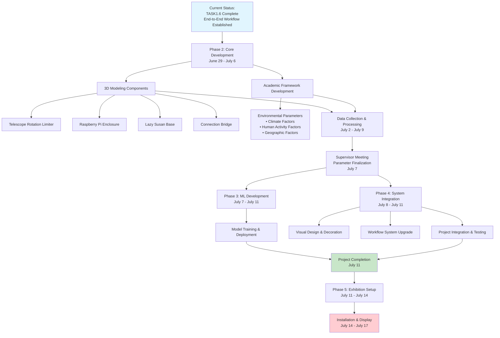

# 2025/06/22--2025/06/29

## Tasks for This Week:

## Work Progress:

### Key Accomplishments:
- **Completed TASK1.6**: Successfully integrated the entire workflow from user input to AI image generation and web display
- **System Integration**: Established end-to-end functionality connecting Raspberry Pi hardware interface with cloud-based prediction and visualization services

### Next Phase Planning:
- **3D Modeling**: Initiated design for telescope mounting system and interactive components
- **Academic Framework**: Developing comprehensive environmental prediction parameter system with three core dimensions:
  - Meteorological & Climate Factors
  - Human Activity & Socioeconomic Factors  
  - Geospatial & Topographic Factors
- **Data Collection**: Preparing to acquire corresponding datasets for model training
- **Supervisor Meeting**: Scheduled to finalize parameter framework before proceeding to final implementation stage

