# Obscura No.7 - Interactive Virtual Telescope Art Installation

## 📋 Project Overview

**Project Name**: Obscura No.7 - Interactive Virtual Telescope Art Installation  
**Duration**: May 6, 2025 - August 22, 2025 (108 days)  
**Architecture**: Three-tier distributed cloud architecture with physical hardware interaction  
**Core Concept**: Users interact with a Raspberry Pi-based telescope installation to generate AI-powered future environmental predictions displayed as artistic visualizations

---

## 🎯 Project Stages Overview
---
**FLOW CHART**

```mermaid
graph TD
    A[🚀 Project Start<br/>May 6, 2025] --> B[📋 Stage 1: Preparation<br/>7 days]
    
    B --> B1[🔧 Hardware Setup]
    B --> B2[🌐 API Integration]
    B --> B3[⚡ Basic Workflow]
    
    B1 --> C[🛠️ Stage 2: Core Development<br/>40 days]
    B2 --> C
    B3 --> C
    
    C --> C1[🔌 Hardware Development<br/>10 days]
    C --> C2[🤖 Software & ML<br/>21 days]
    C --> C3[🎨 3D Modeling<br/>20 days]
    C --> C4[🌐 Web Development<br/>21 days]
    
    C1 --> D[🔄 Stage 3: Integration<br/>15 days]
    C2 --> D
    C3 --> D
    C4 --> D
    
    D --> D1[⚙️ System Integration<br/>10 days]
    D --> D2[🎪 Exhibition Prep<br/>15 days]
    
    D1 --> E[🎯 Stage 4: Exhibition Prep<br/>15 days]
    D2 --> E
    
    E --> E1[🔧 Final Optimizations]
    E --> E2[📦 Installation<br/>July 14-17]
    
    E1 --> F[📝 Stage 5: Dissertation<br/>35 days]
    E2 --> F
    
    F --> G[🎓 Final Submission<br/>August 22, 2025]
    
    %% Key Milestones
    C --> M1[📋 Exhibition Proposal<br/>June 19]
    D --> M2[📱 QR Code Ready<br/>July 2]
    
    %% Styling
    classDef stageBox fill:#e1f5fe,stroke:#01579b,stroke-width:2px
    classDef milestone fill:#fff3e0,stroke:#e65100,stroke-width:2px
    classDef critical fill:#ffebee,stroke:#c62828,stroke-width:2px
    
    class B,C,D,E,F stageBox
    class M1,M2,G milestone
    class E2 critical
```

---

**GANTT CHART**

---

### **Stage 1: Preparation Phase** (7 days)
**Timeline**: 2025/05/06 - 2025/05/12

**Core Objectives**:
- Hardware procurement and setup (Raspberry Pi 4, electronic components)
- Basic workflow development and testing
- Initial API integrations (OpenWeather, OpenAI)

**Key Deliverables**:
- ✅ Raspberry Pi initialization and remote access setup
- ✅ Basic Python script for API integration and image generation
- ✅ Initial hardware-software integration testing

---

### **Stage 2: Core Development Phase** (40 days)
**Timeline**: 2025/05/13 - 2025/06/21  
**Key Milestone**: Exhibition Proposal (2025/06/19)  
**Mid-term Review**: Early June development checkpoint

**Phase Structure**:

#### **Hardware Development** (10 days: 2025/05/26 - 2025/06/01)
- Integration of encoder controls (distance, time, generation trigger)
- Circuit development and GPIO expansion board implementation
- HyperPixel display integration and testing
- Complete hardware workflow validation

#### **Parallel Development Tasks** (3 weeks: 2025/06/09 - 2025/06/30)

**Software & ML Development**:
- Machine learning regression model development and deployment
- Cloud-based ML service architecture
- Data visualization and prediction accuracy optimization
- Complete pipeline: Environmental Data → ML Prediction → AI Image Generation → Cloud Sync

**3D Modeling & Enclosure** (20 days):
- Steampunk-style telescope enclosure design
- 3D model segmentation and printing preparation
- Hardware integration planning within physical enclosure

**Web Development** (replacing Flutter App after supervisor meeting):
- Web-based user interface for exhibition gallery
- Real-time image synchronization between Raspberry Pi and web platform
- Interactive data visualization for prediction analytics

---

### **Stage 3: Integration Phase** (15 days)
**Timeline**: 2025/06/22 - 2025/07/06  
**Key Milestone**: QR Code Text Preparation (2025/07/02)

**Integration Tasks** (10 days):
- End-to-end workflow integration and optimization
- Machine learning model accuracy improvements
- Web platform user experience optimization
- Complete system testing and debugging

**Exhibition Preparation** (15 days):
- Steampunk-style enclosure completion
- Product introduction video creation
- Installation setup planning

---

### **Stage 4: Exhibition Preparation** (15 days)
**Timeline**: 2025/07/07 - 2025/07/18  
**Installation Period**: 2025/07/14 - 2025/07/17

**Objectives**:
- Final system optimizations and bug fixes
- Exhibition setup and installation
- User testing and experience refinement
- Documentation and presentation materials

---

### **Stage 5: Dissertation Writing** (35 days)
**Timeline**: 2025/07/19 - 2025/08/22

**Focus Areas**:
- Academic research documentation
- Technical implementation analysis
- User interaction studies and results
- Future work and research implications

---

## 🏗️ Technical Architecture Summary

### **Hardware Components**
| Component | Purpose | Connection |
|-----------|---------|------------|
| Raspberry Pi 4 | Main controller | - |
| HyperPixel Display | AI image visualization | 40-pin GPIO direct connection |
| Distance Control Encoder | Exploration distance control | I2C-3 (GPIO23/24) |
| Time Control Encoder | Future time prediction control | I2C-5 (GPIO5/6) |
| QMC5883L Magnetometer | Direction sensing (replacing GPS) | I2C-4 (GPIO20/21) |

### **Software Stack**
- **Backend**: Flask application with cloud deployment
- **ML Pipeline**: Scikit-learn/TensorFlow regression models
- **APIs**: OpenWeather, Google Maps, OpenAI DALL-E
- **Database**: PostgreSQL + Cloudinary CDN
- **Frontend**: Web-based exhibition gallery

### **Key Design Decisions**
1. **GPS Module → Magnetometer**: Switched from GPS to magnetometer-based direction sensing for better indoor exhibition performance
2. **Flutter App → Web Platform**: Changed to web-based interface for cross-platform accessibility without app installation requirements
3. **Cloud ML Deployment**: Centralized ML processing for scalability and real-time data visualization

---

## 📊 Project Milestones

| Date | Milestone | Status |
|------|-----------|--------|
| 2025/05/12 | Stage 1 Complete - Basic Hardware Setup | ✅ |
| 2025/06/01 | Hardware Integration Complete | ✅ |
| 2025/06/15 | Core Workflow Development | ✅ |
| 2025/06/19 | Exhibition Proposal Submission | 📋 |
| 2025/07/02 | QR Code Integration Ready | 📋 |
| 2025/07/17 | Exhibition Installation Complete | 📋 |
| 2025/08/22 | Final Dissertation Submission | 📋 |

---

## 🎨 Project Vision

Obscura No.7 transforms the traditional concept of observation by enabling users to "see" future environmental conditions through AI-generated artistic interpretations. By combining physical interaction (distance, direction, time controls) with machine learning predictions and generative AI, the installation creates an immersive experience that bridges present reality with predicted futures.

The project serves both as an interactive art piece and a research platform for exploring human-AI collaboration in environmental prediction and artistic expression.
