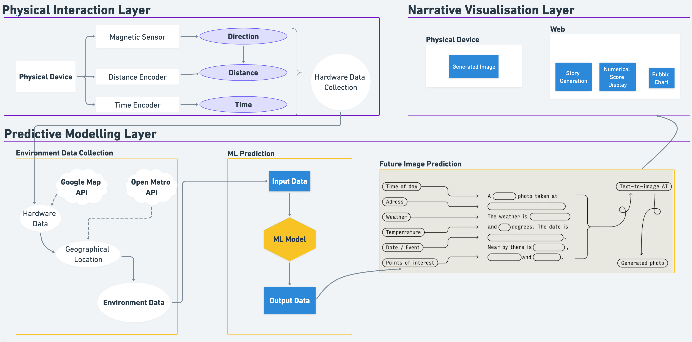
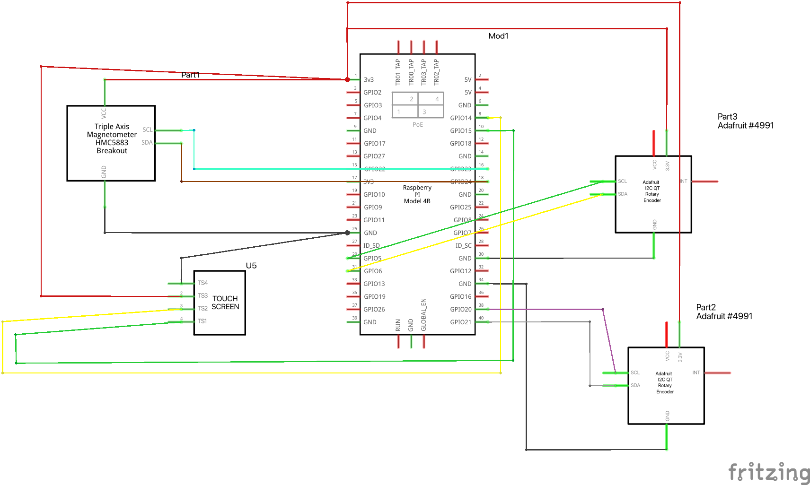
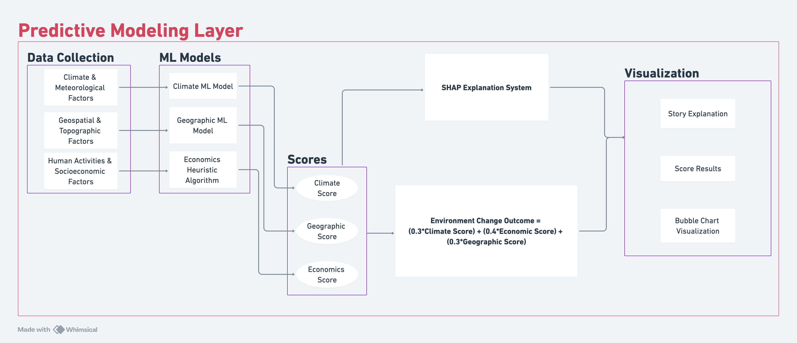
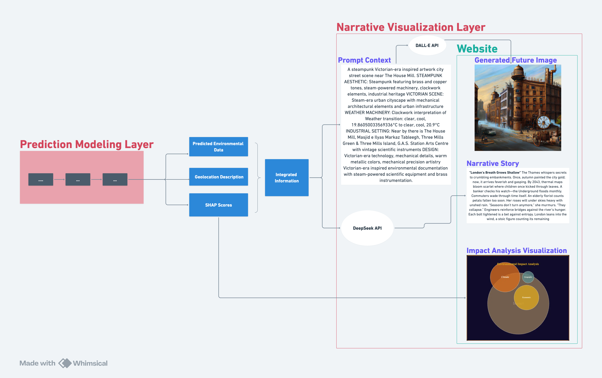

# 🔭 Obscura No.7 - AI-Powered Environmental Prediction & Art Generation System

    

## 📖 Project Overview

Obscura No.7 is an innovative AI-powered environmental prediction and visualization speculative inferface that transforms real-time environmental data into interpretable predictions and generates unique representations of future environmental scenarios. The system integrates machine learning models, SHAP explainability analysis, and AI art generation to create a comprehensive platform for environmental storytelling and visualization.

<table>
  <tr>
    <td align="center">
      
    </td>
    <td align="center">
      
    </td>
  </tr>
</table>

## ✨ Core Features

* 🌍 **Real-time Environmental Data Collection**: Integrates OpenWeather API, Google Maps API, and multiple environmental sensors for comprehensive data acquisition
* 🤖 **Hybrid Machine Learning Models**: LSTM + Random Forest models for climate and geographic predictions with 66-feature engineering
* 🔍 **SHAP Explainability Analysis**: Advanced interpretability framework providing transparent AI decision-making insights
* 🎨 **AI Art Generation**: OpenAI DALL-E 3 integration for creating unique environmental scenario visualizations
* 📊 **Interactive Data Visualization**: Real-time bubble charts, heatmaps, and geographic distribution analysis
* 📖 **AI Narrative Generation**: Automated storytelling system generating environmental prophecy narratives
* 🌐 **Web-based Interface**: Responsive Flask application with real-time WebSocket updates
* 💾 **Dual Storage Architecture**: PostgreSQL for structured data + Cloudinary for image assets
* 🎯 **Multi-style Art Support**: 5 distinct artistic styles (Realistic, Comic, Futuristic, Steampunk, Watercolor)
* 📍 **Geographic Focus**: Specialized for UK environmental analysis (London, Manchester, Edinburgh)

## 🏗️ System Architecture

### Overall Workflow

<div align="center">
  
  <p><em>Figure: Obscura No.7 System Architecture and Workflow</em></p>
</div>

The Obscura No.7 system operates through a three-layer architecture that seamlessly integrates physical interaction, predictive modeling, and narrative visualization. The **Physical Interaction Layer** captures real-world inputs through magnetic sensors (direction), distance encoders, and time encoders, which feed into the hardware data collection system. This data flows into the **Predictive Modeling Layer**, where environmental data from Google Maps API and Open-Meteo API is combined with geographical location information to create comprehensive input datasets. The machine learning model processes this input data through hybrid algorithms to generate output predictions. Finally, the **Narrative Visualization Layer** transforms these predictions into rich multimedia experiences - generating AI artwork, environmental stories, numerical score displays, and interactive bubble charts that are presented through both web and physical device interfaces. This cyclical workflow creates a continuous feedback loop between physical world observations, AI-driven environmental predictions, and immersive storytelling visualizations.

### Physical Interaction Layer

<div align="center">
  
  <p><em>Figure: Hardware Components Overview</em></p>
</div>

<div align="center">
  
  <p><em>Figure: System Electronic Schematics and Connections</em></p>
</div>


The physical interaction layer serves as the primary interface between users and the system, enabling precise spatial targeting and real-time environmental data collection through specialized hardware components:

| Component | Model/Specification | Function | Interface |
|-----------|-------------------|----------|-----------|
| **Main Controller** | Raspberry Pi 4 Model B (4GB RAM) | Core processing unit for real-time prediction and image generation | GPIO/I²C/SPI |
| **Display** | HyperPixel 4.0 Touch Display (480×480) | Visual output and direct user interaction | Capacitive Touch + GPIO |
| **Distance Control** | Adafruit Seesaw I²C Rotary Encoder | Distance parameter control (0–50 km) | I²C Interface |
| **Temporal Control** | Adafruit Seesaw I²C Rotary Encoder | Time setting control (0–200 years) | I²C Interface |
| **Orientation Sensor** | HMC5883L 3-axis Digital Compass | Spatial direction detection for targeting | I²C Interface |
| **Expansion Interface** | GPIO Expansion Dock | Additional peripheral connectivity | GPIO Extension |

The system combines compass heading with distance encoder input to calculate precise geographic coordinates for environmental prediction, while maintaining steampunk-inspired mechanical interaction design.


### Predictive Modeling Layer

<div align="center">
  
  <p><em>Figure: Predictive Modeling Layer - Data Flow and SHAP Analysis</em></p>
</div>

The predictive modeling layer forms the analytical core of Obscura No.7, transforming multi-source environmental data into interpretable predictions through a hybrid machine learning approach. The system processes three distinct data categories: **Climate & Meteorological Factors**, **Geospatial & Topographic Factors**, and **Human Activities & Socioeconomic Factors**.

These inputs feed into specialized ML models: a **Climate ML Model** and **Geographic ML Model** that generate corresponding scores, while an **Economics Heuristic Algorithm** produces economic assessments. The three scores are then combined using weighted coefficients to calculate the **Environment Change Outcome**:

```
Environment Change Outcome = 0.3 × Climate Score + 0.4 × Economic Score + 0.3 × Geographic Score
```


### Narrative Visualization Layer

<div align="center">
  
  <p><em>Figure: Narrative Visualization Layer - From Prediction to Interactive Storytelling</em></p>
</div>

The narrative visualization layer transforms abstract predictions into engaging, multi-modal user experiences through three integrated components presented as interactive cards on the website.

The **AI-Generated Image** component utilizes the DALL-E API with carefully engineered prompts that combine predicted weather conditions, local geographic context, and artistic style selection (realistic, steampunk, watercolor, comic, or futuristic). Images are stored with their prompts in Cloudinary to ensure reproducibility and enable style consistency across sessions.

The **Narrative Story** component employs the DeepSeek API to generate contextual environmental stories based on SHAP scores, location metadata, and the three most influential contributing features. The system produces dramatized narratives in various styles—from futuristic weather reports to observational environmental chronicles—making complex predictions accessible and engaging. A robust fallback template system ensures narrative generation continues even when external APIs are unavailable.

The **Interactive SHAP Bubble Chart** provides dynamic visualization of feature importance through an Impact Analysis interface. Bubble sizes represent feature importance magnitudes, colors indicate positive or negative environmental impacts, and interactive elements allow users to hover for detailed information, zoom into sub-features, and toggle between comprehensive and focused analytical views. This visualization bridges the gap between technical SHAP analysis and intuitive user understanding.


## 📁 Project Structure

```
CASA0022_Obscura-No.7/
├── api/                          # Flask backend application
│   ├── routes/                   # API endpoints and route handlers
│   │   ├── images.py            # Image generation and SHAP analysis
│   │   ├── ml_predict.py        # Machine learning predictions
│   │   ├── shap_predict.py      # SHAP explainability analysis
│   │   └── environmental.py     # Environmental data processing
│   ├── utils/                    # Utility modules
│   │   ├── real_time_environmental_data_collector.py
│   │   ├── simplified_feature_engineer.py
│   │   ├── score_normalizer.py
│   │   └── responses.py
│   ├── templates/               # HTML templates
│   ├── static/                  # CSS, JavaScript, and static assets
│   ├── models/                  # Trained ML models
│   ├── schemas/                 # Data validation schemas
│   └── app.py                   # Main Flask application
├── ML_Models/                   # Machine learning components
│   ├── models/                  # Model training and deployment
│   │   ├── model_inference/     # Model inference engines
│   │   ├── shap_deployment/     # SHAP framework deployment
│   │   └── model_deployment/    # Production model deployment
│   ├── predictions/             # Prediction outputs and logs
│   └── validation_reports/      # Model validation and performance reports
├── WorkFlow/                    # Workflow automation
│   ├── RasberryPi_Workflow/    # Raspberry Pi integration
│   │   ├── raspberry_pi_deployment/
│   │   └── task16_cloud_integration/
│   └── NonRasberryPi_Workflow/ # Local development workflow
├── Hardware/                    # Hardware integration code
│   ├── HMC5833L/               # Compass sensor integration
│   └── I2C_Encoder/            # Rotary encoder handling
├── visualization/              # Data analysis and visualization scripts
├── Documentation/              # Project documentation and reports
│   ├── Meetings/               # Supervisor meeting notes
│   └── Weekly Progress Reports/
├── img/                        # Project concept images
├── logs/                       # System logs and debugging
└── requirements.txt            # Python dependencies
```

### Key Components

#### Backend API (`/api`)
- **Flask Application**: RESTful API with Blueprint architecture
- **ML Integration**: Real-time predictions with LSTM and Random Forest models
- **SHAP Framework**: Explainable AI analysis and visualization
- **Image Processing**: DALL-E integration and Cloudinary storage
- **Environmental Data**: Multi-source real-time data collection

#### Machine Learning (`/ML_Models`)
- **Hybrid Models**: Climate (Random Forest) + Geographic (LSTM) prediction
- **Feature Engineering**: 66-feature transformation pipeline
- **Model Deployment**: Production-ready model serving
- **Validation**: Comprehensive model performance evaluation

#### Hardware Integration (`/Hardware`, `/WorkFlow`)
- **Raspberry Pi**: IoT sensor integration and edge computing
- **Sensor Support**: Compass, encoder, and environmental sensors
- **Cloud Integration**: Seamless cloud-edge data synchronization

#### Documentation (`/Documentation`)
- **Weekly Reports**: Detailed development progress tracking
- **Meeting Notes**: Supervisor consultation records
- **Technical Documentation**: System architecture and API documentation

## 📞 Contact

* **Project Maintainer**: Youtian Peng
* **Email**: slimrorschach@outlook.com
* **Institution**: UCL Centre for Advanced Spatial Analysis (CASA)

---
*"Time present and time past
Are both perhaps present in time future,
And time future contained in time past.
If all time is eternally present
All time is unredeemable."* - T.S. Eliot
