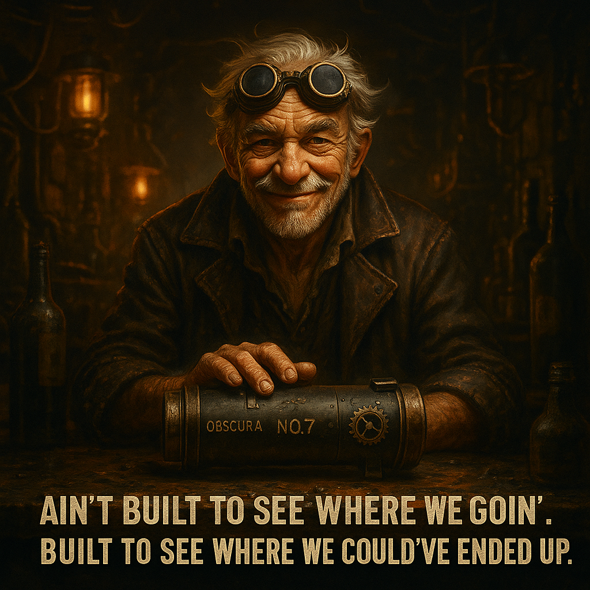
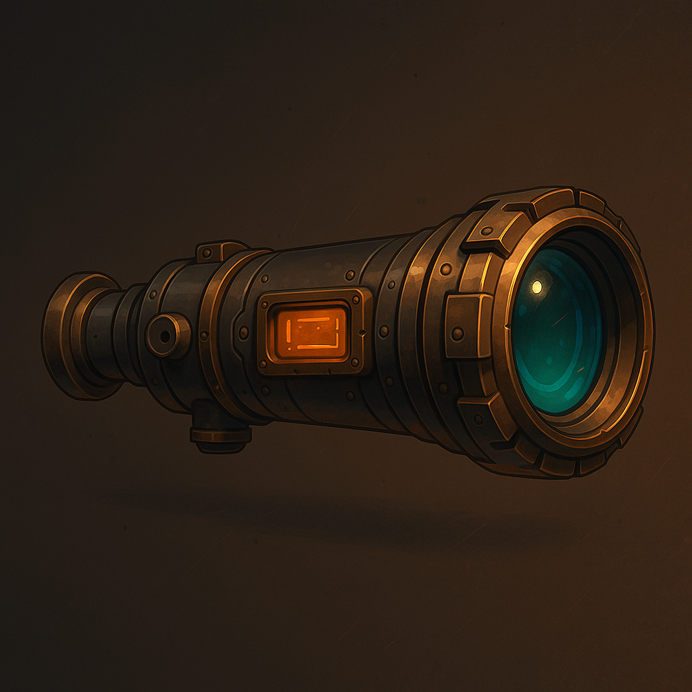

# CASA0022_Obscura-No.7

The air in the bar was thick with engine oil and burned ozone, lit only by the dull orange glow of gas-lamps flickering in the riveted ceiling. Somewhere in the corner, a broken radio whispered forgotten frequencies. He sat hunched at a warped brass table, goggles pushed up into his graying hair, coat scorched at the edges like it had seen too many exits from bad situations.

Without a word, he reached into a leather-worn case and set it down with a weighty clunk—Obscura No.7. Its body was matte blackened steel, etched with glyphs half-faded and one brass gear that still spun, slow and stubborn, like it remembered what time used to feel like.

He didn’t look up. Just ran a finger along its side, then spoke like gravel scraping a gearbox:

**“Ain’t built to see where we’re goin’. Built to see where we could’ve ended up.”**

<table>
  <tr>
    <td align="center">
      
    </td>
    <td align="center">
      
    </td>
  </tr>
</table>
