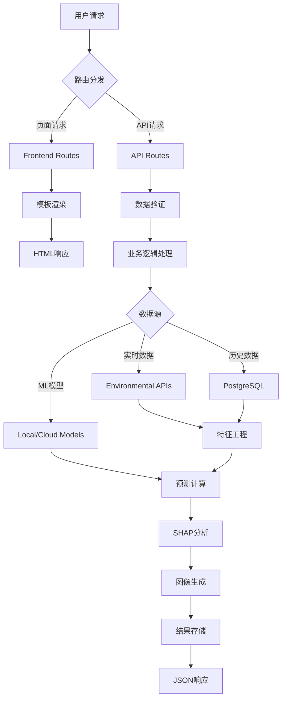

# Obscura No.7 - Web Application Architecture


## 🏗️ Architecture Overview

Obscura No.7采用现代化的三层Web架构，以Flask为核心构建了一个集成机器学习预测、SHAP可解释性分析和AI图像生成的环境预测可视化平台。

```
┌─────────────────────────────────────────────────────┐
│                 Presentation Layer                  │
│  ┌─────────────────┐ ┌─────────────────────────────┐ │
│  │   HTML Templates │ │    Static Assets (CSS/JS)  │ │
│  │   - Steampunk UI │ │    - Interactive Charts    │ │
│  │   - Gallery View │ │    - SHAP Visualizations   │ │
│  │   - Prediction   │ │    - Real-time Updates     │ │
│  └─────────────────┘ └─────────────────────────────┘ │
└─────────────────────────────────────────────────────┘
                              │
┌─────────────────────────────────────────────────────┐
│                  Business Layer                     │
│  ┌─────────────────┐ ┌─────────────────────────────┐ │
│  │   Flask Routes  │ │     Utility Modules         │ │
│  │   - API Gateway │ │     - ML Integration        │ │
│  │   - Data Flow   │ │     - Environmental Data    │ │
│  │   - WebSocket   │ │     - Feature Engineering   │ │
│  └─────────────────┘ └─────────────────────────────┘ │
└─────────────────────────────────────────────────────┘
                              │
┌─────────────────────────────────────────────────────┐
│                   Data Layer                        │
│  ┌─────────────────┐ ┌─────────────────────────────┐ │
│  │   PostgreSQL    │ │    External APIs            │ │
│  │   - Predictions │ │    - OpenWeather            │ │
│  │   - Images      │ │    - Google Maps            │ │
│  │   - Analysis    │ │    - OpenAI DALL-E          │ │
│  └─────────────────┘ └─────────────────────────────┘ │
└─────────────────────────────────────────────────────┘
```

## 📂 Directory Structure

```
api/
├── app.py                      # 主Flask应用入口
├── requirements.txt            # 项目依赖
├── routes/                     # API路由模块
│   ├── __init__.py            # 蓝图注册
│   ├── frontend.py            # 前端页面路由
│   ├── images.py              # 图像生成与SHAP分析
│   ├── ml_predict.py          # 机器学习预测
│   ├── shap_predict.py        # SHAP可解释性分析
│   ├── environmental.py       # 环境数据处理
│   ├── admin.py               # 管理功能
│   └── health.py              # 健康检查
├── utils/                      # 工具模块
│   ├── real_time_environmental_data_collector.py
│   ├── simplified_feature_engineer.py
│   ├── real_time_feature_engineer.py
│   ├── improved_economic_calculator.py
│   ├── score_normalizer.py
│   ├── model_downloader.py
│   ├── responses.py
│   └── validators.py
├── templates/                  # HTML模板
│   ├── base.html              # 基础模板
│   ├── home.html              # 主页
│   ├── gallery.html           # 图片画廊
│   ├── prediction.html        # 预测页面
│   ├── image_detail.html      # 图片详情
│   ├── about.html             # 关于页面
│   └── components/            # 组件模板
├── static/                     # 静态资源
│   ├── css/                   # 样式文件
│   ├── js/                    # JavaScript模块
│   └── images/                # 静态图片
├── schemas/                    # 数据验证模式
├── models/                     # 本地ML模型
└── logs/                       # 应用日志
```

## 🛠️ Core Components

### 🌐 Frontend Layer (`/templates`, `/static`)

**模板系统**
- **Steampunk主题设计**: 工业风格的用户界面，契合"时间望远镜"概念
- **响应式布局**: 支持多设备访问的自适应设计
- **组件化开发**: 可复用的HTML组件模板

**交互功能**
- **实时预测**: WebSocket支持的动态数据更新
- **SHAP可视化**: 交互式泡泡图表，支持缩放和悬停
- **图片画廊**: 分页、筛选和排序功能
- **详情页面**: 完整的预测结果展示

### 🔌 API Layer (`/routes`)

#### 核心路由模块

| 模块 | 功能 | 主要端点 |
|------|------|----------|
| `frontend.py` | 前端页面路由 | `/`, `/gallery`, `/prediction` |
| `images.py` | 图像生成与分析 | `/api/v1/images`, `/api/v1/shap-analysis` |
| `ml_predict.py` | ML预测服务 | `/api/v1/predict`, `/api/v1/batch-predict` |
| `shap_predict.py` | SHAP解释性分析 | `/api/v1/shap`, `/api/v1/feature-importance` |
| `environmental.py` | 环境数据处理 | `/api/v1/environmental`, `/api/v1/weather` |
| `admin.py` | 管理功能 | `/api/v1/admin/*` |
| `health.py` | 系统监控 | `/api/v1/health`, `/api/v1/status` |

#### API设计原则

- **RESTful架构**: 标准化的HTTP方法和状态码
- **版本控制**: `/api/v1/`前缀支持API版本管理
- **统一响应格式**: 标准化的JSON响应结构
- **错误处理**: 完善的异常捕获和错误信息返回
- **输入验证**: 基于schemas的数据验证

### 🔧 Business Logic (`/utils`)

#### 核心工具模块

**数据收集与处理**
- `real_time_environmental_data_collector.py`: 多源环境数据实时采集
- `simplified_feature_engineer.py`: 66特征工程管道
- `real_time_feature_engineer.py`: 实时特征计算

**机器学习集成**
- `model_downloader.py`: 云端模型自动下载与更新
- `score_normalizer.py`: 预测分数标准化处理
- `improved_economic_calculator.py`: 经济指标启发式算法

**系统工具**
- `responses.py`: 统一响应格式处理
- `validators.py`: 数据验证与清洗

## 🔄 Data Flow Architecture



## 🚀 Key Features

### 🤖 Machine Learning Integration

- **混合模型架构**: LSTM + Random Forest + 启发式算法
- **实时预测**: 基于地理位置和时间参数的环境预测
- **特征工程**: 66维特征向量，包含滞后特征和变化率
- **模型服务**: 支持单次预测和批量预测

### 🎯 SHAP Explainability

- **特征重要性分析**: 气候、地理、经济三维度解释
- **可视化组件**: 交互式泡泡图、热力图、条形图
- **层次化展示**: 支持维度级和特征级的详细分析
- **实时计算**: 动态生成SHAP值和可视化

### 🎨 AI Image Generation

- **提示词工程**: 模块化、多风格的智能提示构建
- **艺术风格**: 支持现实主义、蒸汽朋克、水彩、漫画、未来主义
- **云存储集成**: Cloudinary CDN优化和自动图像处理
- **元数据管理**: 完整的生成参数和分析数据存储

### 📊 Real-time Visualization

- **WebSocket连接**: 实时数据推送和状态更新
- **交互式图表**: Chart.js支持的动态数据可视化
- **响应式设计**: 多设备兼容的用户界面
- **性能优化**: 异步加载和缓存机制

## 🔐 Security & Performance

### 安全特性
- **输入验证**: 所有用户输入的严格验证和清洗
- **SQL注入防护**: 参数化查询和ORM保护
- **XSS防护**: 模板自动转义和CSP头部
- **CORS配置**: 精确的跨域请求控制

### 性能优化
- **异步处理**: 长时间操作的后台队列处理
- **缓存机制**: Redis缓存和应用级缓存
- **连接池**: 数据库连接池优化
- **CDN集成**: 静态资源和图片的CDN加速

## 🌍 Deployment

### 环境配置
```bash
# 安装依赖
pip install -r requirements.txt

# 环境变量配置
export FLASK_APP=app.py
export FLASK_ENV=production
export DATABASE_URL=postgresql://...
export CLOUDINARY_URL=cloudinary://...

# 启动应用
python app.py
```

### Docker部署
```dockerfile
FROM python:3.11-slim
WORKDIR /app
COPY requirements.txt .
RUN pip install -r requirements.txt
COPY . .
EXPOSE 5000
CMD ["python", "app.py"]
```

## 📈 Monitoring & Logging

- **应用日志**: 分级日志记录（DEBUG, INFO, ERROR）
- **性能监控**: 请求响应时间和资源使用跟踪
- **错误追踪**: 详细的异常堆栈和上下文信息
- **健康检查**: `/api/v1/health`端点的系统状态监控

## 🤝 API Documentation

完整的API文档请参考各路由模块中的详细注释和docstring。所有API端点都支持标准的HTTP状态码和统一的JSON响应格式。

---

*本架构支持Obscura No.7的完整功能，包括环境预测、AI图像生成、SHAP可解释性分析和交互式数据可视化。* 