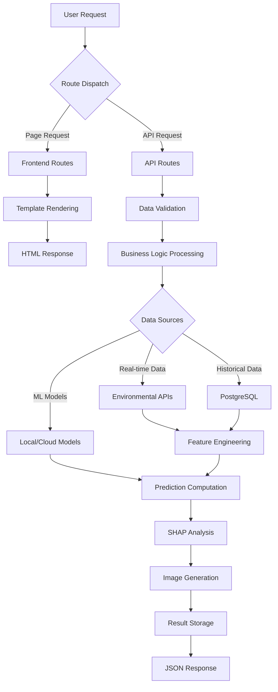

# Obscura No.7 - Web Application Architecture


## 🏗️ Architecture Overview

Obscura No.7 adopts a modern three-tier web architecture, built around Flask as the core framework to create an integrated platform for machine learning predictions, SHAP explainability analysis, and AI image generation for environmental prediction visualization.

```
┌─────────────────────────────────────────────────────┐
│                 Presentation Layer                  │
│  ┌─────────────────┐ ┌─────────────────────────────┐ │
│  │   HTML Templates │ │    Static Assets (CSS/JS)  │ │
│  │   - Steampunk UI │ │    - Interactive Charts    │ │
│  │   - Gallery View │ │    - SHAP Visualizations   │ │
│  │   - Prediction   │ │    - Real-time Updates     │ │
│  └─────────────────┘ └─────────────────────────────┘ │
└─────────────────────────────────────────────────────┘
                              │
┌─────────────────────────────────────────────────────┐
│                  Business Layer                     │
│  ┌─────────────────┐ ┌─────────────────────────────┐ │
│  │   Flask Routes  │ │     Utility Modules         │ │
│  │   - API Gateway │ │     - ML Integration        │ │
│  │   - Data Flow   │ │     - Environmental Data    │ │
│  │   - WebSocket   │ │     - Feature Engineering   │ │
│  └─────────────────┘ └─────────────────────────────┘ │
└─────────────────────────────────────────────────────┘
                              │
┌─────────────────────────────────────────────────────┐
│                   Data Layer                        │
│  ┌─────────────────┐ ┌─────────────────────────────┐ │
│  │   PostgreSQL    │ │    External APIs            │ │
│  │   - Predictions │ │    - OpenWeather            │ │
│  │   - Images      │ │    - Google Maps            │ │
│  │   - Analysis    │ │    - OpenAI DALL-E          │ │
│  └─────────────────┘ └─────────────────────────────┘ │
└─────────────────────────────────────────────────────┘
```

## 📂 Directory Structure

```
api/
├── app.py                      # Main Flask application entry point
├── requirements.txt            # Project dependencies
├── routes/                     # API route modules
│   ├── __init__.py            # Blueprint registration
│   ├── frontend.py            # Frontend page routing
│   ├── images.py              # Image generation and SHAP analysis
│   ├── ml_predict.py          # Machine learning predictions
│   ├── shap_predict.py        # SHAP explainability analysis
│   ├── environmental.py       # Environmental data processing
│   ├── admin.py               # Administrative functions
│   └── health.py              # Health check endpoints
├── utils/                      # Utility modules
│   ├── real_time_environmental_data_collector.py
│   ├── simplified_feature_engineer.py
│   ├── real_time_feature_engineer.py
│   ├── improved_economic_calculator.py
│   ├── score_normalizer.py
│   ├── model_downloader.py
│   ├── responses.py
│   └── validators.py
├── templates/                  # HTML templates
│   ├── base.html              # Base template
│   ├── home.html              # Homepage
│   ├── gallery.html           # Image gallery
│   ├── prediction.html        # Prediction page
│   ├── image_detail.html      # Image details
│   ├── about.html             # About page
│   └── components/            # Component templates
├── static/                     # Static assets
│   ├── css/                   # Stylesheets
│   ├── js/                    # JavaScript modules
│   └── images/                # Static images
├── schemas/                    # Data validation schemas
├── models/                     # Local ML models
└── logs/                       # Application logs
```

## 🛠️ Core Components

### 🌐 Frontend Layer (`/templates`, `/static`)

**Template System**
- **Steampunk Theme Design**: Industrial-style user interface aligned with the "Time Telescope" concept
- **Responsive Layout**: Adaptive design supporting multi-device access
- **Component-based Development**: Reusable HTML component templates

**Interactive Features**
- **Real-time Predictions**: WebSocket-supported dynamic data updates
- **SHAP Visualization**: Interactive bubble charts with zoom and hover support
- **Image Gallery**: Pagination, filtering, and sorting functionality
- **Detail Pages**: Complete prediction result displays

### 🔌 API Layer (`/routes`)

#### Core Route Modules

| Module | Function | Main Endpoints |
|--------|----------|----------------|
| `frontend.py` | Frontend page routing | `/`, `/gallery`, `/prediction` |
| `images.py` | Image generation and analysis | `/api/v1/images`, `/api/v1/shap-analysis` |
| `ml_predict.py` | ML prediction services | `/api/v1/predict`, `/api/v1/batch-predict` |
| `shap_predict.py` | SHAP explainability analysis | `/api/v1/shap`, `/api/v1/feature-importance` |
| `environmental.py` | Environmental data processing | `/api/v1/environmental`, `/api/v1/weather` |
| `admin.py` | Administrative functions | `/api/v1/admin/*` |
| `health.py` | System monitoring | `/api/v1/health`, `/api/v1/status` |

#### API Design Principles

- **RESTful Architecture**: Standardized HTTP methods and status codes
- **Version Control**: `/api/v1/` prefix for API version management
- **Unified Response Format**: Standardized JSON response structure
- **Error Handling**: Comprehensive exception catching and error message returns
- **Input Validation**: Schema-based data validation

### 🔧 Business Logic (`/utils`)

#### Core Utility Modules

**Data Collection and Processing**
- `real_time_environmental_data_collector.py`: Multi-source real-time environmental data collection
- `simplified_feature_engineer.py`: 66-feature engineering pipeline
- `real_time_feature_engineer.py`: Real-time feature computation

**Machine Learning Integration**
- `model_downloader.py`: Automatic cloud model download and updates
- `score_normalizer.py`: Prediction score standardization processing
- `improved_economic_calculator.py`: Economic indicator heuristic algorithms

**System Tools**
- `responses.py`: Unified response format handling
- `validators.py`: Data validation and cleaning

## 🔄 Data Flow Architecture



## 🚀 Key Features

### 🤖 Machine Learning Integration

- **Hybrid Model Architecture**: LSTM + Random Forest + Heuristic algorithms
- **Real-time Predictions**: Environmental predictions based on geographic location and time parameters
- **Feature Engineering**: 66-dimensional feature vectors including lag features and change rates
- **Model Services**: Support for single predictions and batch predictions

### 🎯 SHAP Explainability

- **Feature Importance Analysis**: Three-dimensional explanation across Climate, Geographic, and Economic factors
- **Visualization Components**: Interactive bubble charts, heatmaps, and bar charts
- **Hierarchical Display**: Support for dimension-level and feature-level detailed analysis
- **Real-time Computation**: Dynamic generation of SHAP values and visualizations

### 🎨 AI Image Generation

- **Prompt Engineering**: Modular, multi-style intelligent prompt construction
- **Artistic Styles**: Support for Realistic, Steampunk, Watercolor, Comic, and Futuristic styles
- **Cloud Storage Integration**: Cloudinary CDN optimization and automatic image processing
- **Metadata Management**: Complete storage of generation parameters and analysis data

### 📊 Real-time Visualization

- **WebSocket Connections**: Real-time data push and status updates
- **Interactive Charts**: Chart.js-powered dynamic data visualization
- **Responsive Design**: Multi-device compatible user interface
- **Performance Optimization**: Asynchronous loading and caching mechanisms

## 🔐 Security & Performance

### Security Features
- **Input Validation**: Strict validation and sanitization of all user inputs
- **SQL Injection Protection**: Parameterized queries and ORM protection
- **XSS Protection**: Template auto-escaping and CSP headers
- **CORS Configuration**: Precise cross-origin request control

### Performance Optimization
- **Asynchronous Processing**: Background queue processing for long-running operations
- **Caching Mechanisms**: Redis caching and application-level caching
- **Connection Pooling**: Database connection pool optimization
- **CDN Integration**: CDN acceleration for static assets and images

## 🌍 Deployment

### Environment Configuration
```bash
# Install dependencies
pip install -r requirements.txt

# Environment variable configuration
export FLASK_APP=app.py
export FLASK_ENV=production
export DATABASE_URL=postgresql://...
export CLOUDINARY_URL=cloudinary://...

# Start application
python app.py
```

### Docker Deployment
```dockerfile
FROM python:3.11-slim
WORKDIR /app
COPY requirements.txt .
RUN pip install -r requirements.txt
COPY . .
EXPOSE 5000
CMD ["python", "app.py"]
```

## 📈 Monitoring & Logging

- **Application Logging**: Hierarchical logging (DEBUG, INFO, ERROR)
- **Performance Monitoring**: Request response time and resource usage tracking
- **Error Tracking**: Detailed exception stack traces and context information
- **Health Checks**: System status monitoring via `/api/v1/health` endpoint

## 🤝 API Documentation

Complete API documentation can be found in the detailed comments and docstrings within each route module. All API endpoints support standard HTTP status codes and unified JSON response formats.

---

*This architecture supports the complete functionality of Obscura No.7, including environmental prediction, AI image generation, SHAP explainability analysis, and interactive data visualization.* 